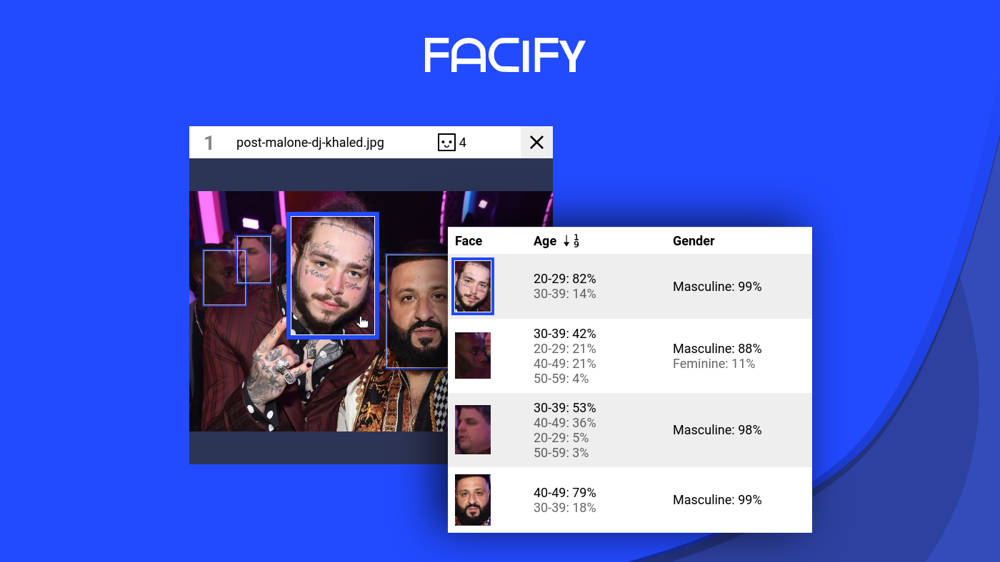

Facify is a face detection web app, that highlights areas of faces in the image and list their demographic features.

By scanning photos, the app can detect faces and also estimates the person’s age, gender and multicultural appearance.

Uploading images are done via Drag and Drop, pasting URL or webcam. The URL Text Input gives visual feedback if the inputs are valid images and also allows you to paste multiple URLs and easily update them.

Successfull upload displays an image with tagged faces accompanied by a Table containing persons’ data. The Table Headers, which contain the data category, are fixed wherever the user scrolls, that way the user understands what the data cell relates to what category, without the need to scroll up. That functionality is not only preserved in Mobile layout, but is also done in a performant manner that doesn’t slow down the page when scrolling.

https://user-images.githubusercontent.com/29286430/136753765-8cf52cb1-b311-4e35-8114-564b7615ebea.mp4

## Tools & Technologies

- Next.js
- React
- Redux
- Nodejs
- Typescript
- CSS
- SVG

## API

- Clarifai
